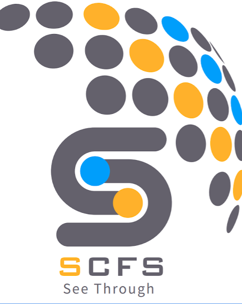

  <a href="" rel="noopener">
    
    

      <h3 align="center" style="margin: 0; padding: 10px; background-color: rgba(0, 0, 0, 0.5); color: white;">EE495 Cryptography</h3>
    

  </a>

---

 Cryptography application, utilizing RFID technology, and FPGA computation
      

## 📝 Table of Contents

- [About](#about)
- [Guide](#guide)
- [Contributing](#contributing)
- [Built Using](#built_using)
- [Authors](#authors)
- [License](#license)
- [Acknowledgments](#acknowledgement)

## :computer: About 

### **Features**
- User-friendly interface
- Key Generation
- RFID Key Storage up to 128 bits
- FPGA Processing Power
- Cloud Data Storage
  
### **Cryptography Algorithms**
- AES-128,192,256 encryption/decryption
- DES-64 encryption/decryption
- RC4-128,256 encryption/decryption
- RSA-16,32,64 encryption/decryption (FPGA)
- and more comming...

### **Requirements**
- Python 3.10+
- PyQt5

### ***Optional***
- FPGA 
- RFID Read/Write Device
- Cloud Storage

## 🏁 Guide 

See [guide](https://github.com/Mshnwq/Encryption-Application/graphs/contributors) for comprehensive guide.

## 🚀 Contributing 

See [contributing](https://github.com/Mshnwq/Encryption-Application/graphs/contributors) for steps.

## ⛏️ Built Using 

- [PyQt5](https://www.qt.io/) - GUI
- [FireBase](https://firebase.google.com/) - Backend

## ✍️ Authors 

- [**@Mshnwq**](https://github.com/Mshnwq) - **Code Structure Design, GUI, RFID, FPGA**
- [@Faisal](https://github.com/FaisalJAbushanab) - **Code Structure Design, Cryptographer, Backend, Testing**
- [@Rhman](https://github.com/) - Cryptographer,
- [@Hetheli](https://github.com/) - Cryptographer, FPGA

See also the list of [contributors](https://github.com/Mshnwq/Encryption-Application/graphs/contributors) who participated in this project.

## License 
This project is licensed under the MIT License - see the [LICENSE](https://github.com/Mshnwq/Encryption-Application/blob/main/LICENSE) file for details.

    <a href="mailto:hmachnouk@scfs.tech">hmachnouk@scfs.tech</a>

    

## 🎉 Acknowledgements 

- Hat tip to anyone whose code was used
- Inspiration
- References
